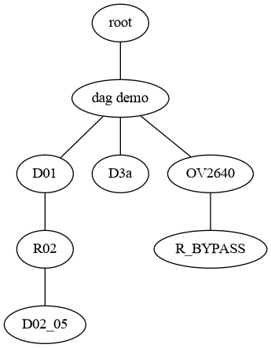
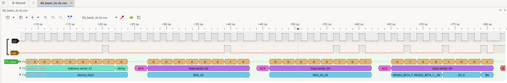

# sigrokdecoder i2c dag

> This is a analyser for analyse protocol based on `i2c` protocol.

## Todos

- [x] iic addr analyse
- [ ] iic data analyse
  - [x] single byte analyse
  - [ ] multibyte analyse
- [x] iic bit analyse
- [x] multi page iic device support
- [ ] indirect address support
- [x] iic data addr auto increase
- [ ] DAG Edit tool
  - Manual edit is too difficult

## usage

1. make a dag file to support your protocol anasyse, 
   Please check `i2c_dag/dag_demo.yml`.
   Your file struct should like this:

   

2. analyse wave by pulsewave
   

## install

``` shell
git clone https://github.com/feilongfl/sigrokdecoder_i2cdag.git SOME_DIR
SIGROKDECODE_DIR=SOME_DIR pulseview

# for example:
SIGROKDECODE_DIR=/home/feilong/.config/pulseview/decorders pulseview
```
